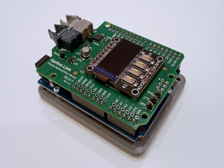
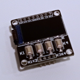
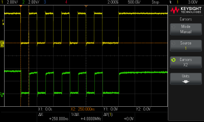
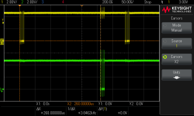
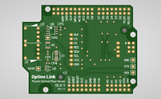

# Optino Link

## Overview
Optino Link is a plastic optical fiber communication design concept intended for use with the Arduino UNO R4.

It enables the construction of high-speed, long-distance ring networks with a device-to-device distance of 20 meters or a maximum speed of 4 Mbps using Renesas RA4M1 based Arduino.

When handling fixed-length data, you can control the network without complex knowledge. Simply determine the payload count and place the data into the transmission array.

## How it works
Optino Link units have no distinction between host and device; their role is determined by commands.

In the newly constructed Optino Link network, the host unit issues command and assigns each unit a unique 1-byte ID. Since `0x00`, `0xFE`, and `0xFF` are reserved, the maximum number of units that can join the network is limited to 253.

All units participating in the network can freely send and receive user data by specifying the destination unit ID.

The current design allows for 256 different command definitions using 1 byte, but the actual number of commands expected to be defined is anticipated to be no more than 16. Therefore, it is possible to split the command byte into upper 4 bits and lower 4 bits, assigning the lower bits to commands and using the upper bits for other purposes.

For example, an application could use the upper 4 bits to define the payload length, indicating that up to 16 bytes of user data can be stored. This is necessary when handling variable-length data in the future. Alternatively, the upper 4 bits could be utilized for managing multiple networks on a single host.

Optino Link is not a standards organization, so feel free to modify it as you like and enjoy it.

## Reserved Unit ID
- `0x00` Repeater, Static UID unit. Used to physically extend the data transmission distance. Received packets are inspected for corruption and forwarded immediately if no issues are found. Corrupted packets are counted and discarded. On screen, it may be displayed as `RP`.
- `0xFE` Broadcast, All Active UID units. No unit with this UID exists. UID preceding the Unassigned unit.
- `0xFF` Unassigned, Active UID unit. Until an UID is assigned, it forwards received packets like a Repeater. In principle, commands can be issued without disrupting the network. This is due to the factory default EEPROM being formatted with 0xFF.

## Optino Link Standard
This specification focuses primarily on being composed solely of the most affordable and readily available devices. Regardless of who designs it, only devices that meet the following functions can be called an Optino Link Unit. This is a compatibility issue.

- Depends on an Arduino UNO R4 or compatible system
- Optical fiber module using the Broadcom HFBR-0500Z Series
- 0.96-inch TFT 80x160 display with ST7735S controller
- Four debounced key input devices, Active high signal
- PCB dimensions are not specified

The small size of the LCD display is because updating the display is a very heavy processing task for the communication unit. Also, since computational resources cannot be allocated to debounce key inputs, the signal must be shaped using a filter on the circuit side.

To reduce the number of parts, it is preferable to adopt a module that integrates the TFT display and keys. Although the manufacturer is unknown, such modules can be obtained on AliExpress. An excellent component that implements a minimal UI with a small footprint.

## Dependencies
This source code depends on the following libraries. These libraries can be installed via the Arduino IDE's Library Manager. We extend our gratitude to Adafruit for providing such an excellent library.

- Adafruit_GFX.h
- Adafruit_ST7735.h

## Packet structure
The packet structure for Optino Link is as follows:

## Explanatory sketch
This repository contains a sketch named OLU1_hello_world.ino, which performs basic operations using the four keys. Verifying the operation of this sketch requires at least three units and three POF cables.

Each unit generates a 1-byte random number. Other units have no way of knowing each other's values. This sketch shows how to transfer these values.

Pressing K1 designates that unit as UID `0x01`, the host, which issues ASSIGN command. It sends userData[0] = 1 to connected units. Receiving units add 1 to this value, recognizing their own UID as `0x02`. This unit updates userData[0] to 2 and forwards it to the next unit. This process assigns each unit a unique UID within the network.

Units newly set to `0x01` by this operation temporarily set the newHost flag and clear it once assign is complete. Units previously set to `0x01` recognize via the newHost flag that they are not the source, update their own UID, and forward the ASSIGN command.

When a new host detects that the ASSIGN command has completed its cycle, it immediately issues an ASSIGN_DONE command to finalize the UIDs for each unit. This command includes the highest-order UID information, allowing all active units to share the network's scope. This is applied to a filter that prevents undeliverable packets from lingering within the optical ring.

Pressing K2, the unit requests data transfer from `0x02`. The receiving `0x02` transfers data to the requesting unit.

Pressing K3 sends data to `0x02`.

Pressing K4 sends data to `0x03`. Unlike K3, there is a 1/10 probability that the data will be corrupted. The receiving unit detects the corruption via CRC checking, discards the packet, and simultaneously increments the CRE value indicating the number of detected CRC errors. If this packet was relayed, `0x03` will not receive the corrupted packet.

Pressing K4 on `0xFF` and `0x00` units toggles these UIDs. This is a feature for experimenting with what role each one plays.

## PC-based network access
Defining ENABLE_PC_COMM allows the PC to communicate with the unit via a USB connection.

The PC uses its UID to access the optical ring. The procedure simply involves sending data in hexadecimal format to the corresponding COM port. There is no implementation of a ring buffer or data integrity verification functionality. The unit adds a CRC checksum to the raw data received from the PC and transmits the packet to the optical ring.

Packets addressed to the PC's own UID are forwarded to the PC after the CRC checksum is removed. As a result, the PC intercepts all received data, including results sent by the connected unit itself.

## Waveforms

**\[Ch1:OTX&emsp;Ch2:TXPD&emsp;500nSec/div\]** This is the waveform for 0x55-0xFE. The width of one bit is 250 nSec, equivalent to 4 MHz. It emits red visible light at a wavelength of 660 nm when the cathode is pulled down.

**\[Ch.1:OTX&emsp;Ch2:ORX&emsp;50uSec/div\]** This is the waveform when four units are connected. The ASSIGN command issued from the host propagated to the three downstream units and was received back at the host after 260 uSec. This calculates to an additional 90 uSec of delay for each unit added. If downstream units also require the received data, the transfer process must be prioritized.

## Technical restriction
The UART port used by this shield conflicts with the I2C port on the UNO R4 Minima. However, the UNO R4 WiFi includes an additional I2C port called Qwiic, so this specification will not cause issues when implementing it in a network. This sketch uses the 3.3V SparkFun Qwiic EEPROM Breakout as external non-volatile memory.

## Reference board

I am distributing the Gerber data for the OLU-1 reference board free of charge. I would like to assess the level of demand, so I will manage the distribution of this data for the time being. Please request the complete set of data from [Kirinote Contact Form](http://148.135.74.205:10000/app/my-workspace/kirinote-contact-form).

## Branding
The font used for the logo expressing the 'Optino Link' concept is Barlow ExtraBold.
